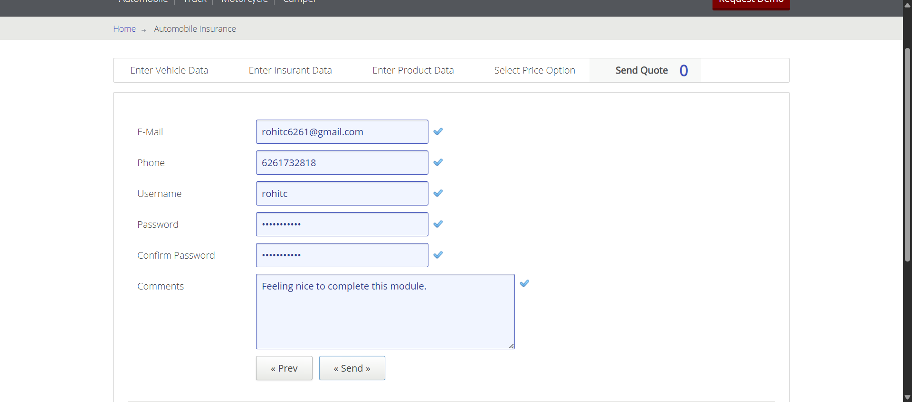
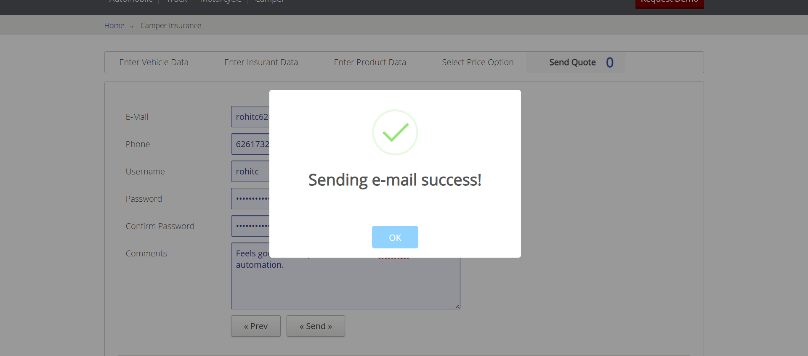
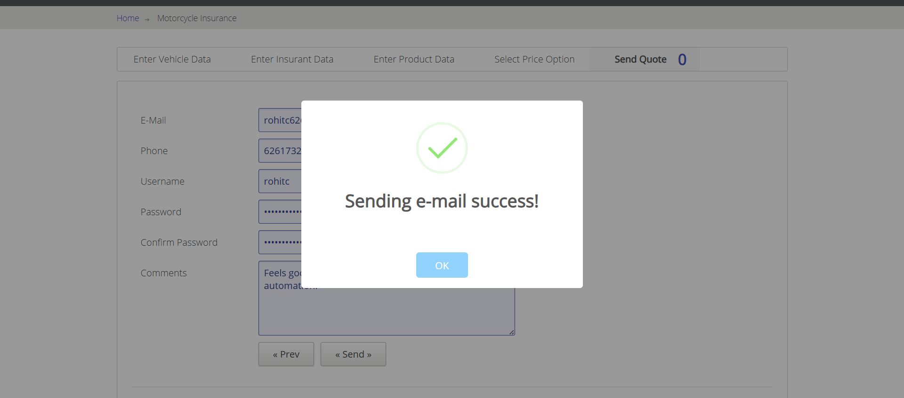
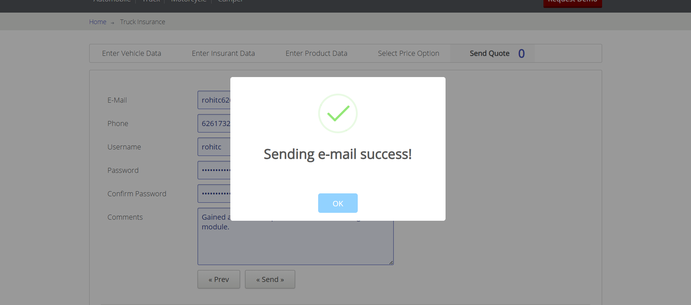

# Tricentis Vehicle Insurance Automation

## Overview
This project automates the Tricentis Vehicle Insurance web application using Java and Selenium WebDriver.

## Technologies Used
- Java
- Selenium WebDriver
- Eclipse IDE

## Modules Automated
- Automobile
- Truck
- Motorcycle
- Camper

## Author
Rohit Chaurasia

## Screenshots

### Automobile Module

### Camper Module

### Motorcycle Module

### Truck Module

